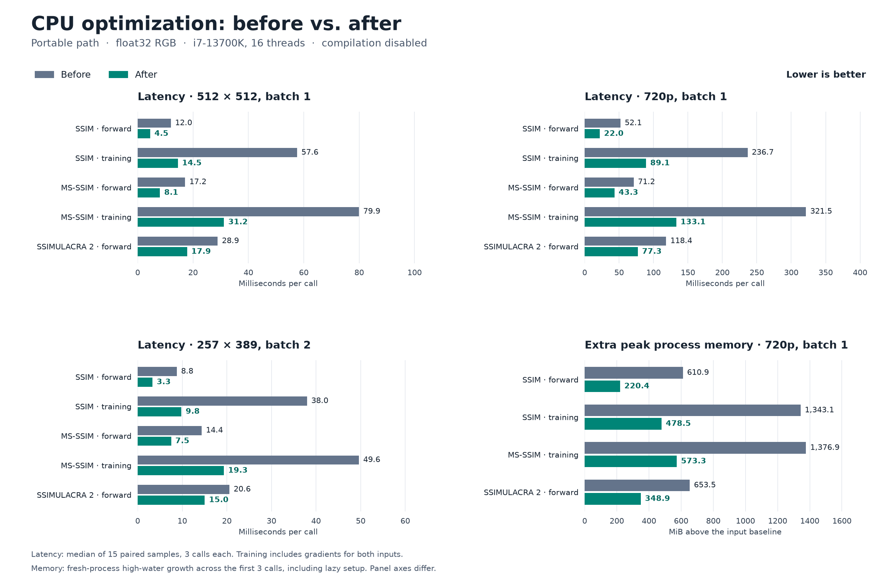

# CPU separable-filter optimization — 2026-09-12

The final candidate improves the measured portable CPU SSIM, MS-SSIM and
SSIMULACRA 2 workloads while reducing process memory growth. Kept after fresh
paired confirmation, the full accuracy suite, differential checks, and independent review.



Regenerate this figure from the saved measurements with
`python bench/plot_cpu_filters.py`. A scalable SVG is saved alongside the PNG.
The confirmation, compiled-path, memory, sanity, and held-out measurements are
retained in `bench/results/cpu_filters_2026-09-12/` so the figure can be reproduced
from a fresh checkout.

## Change and measured target

`functional._separable_conv` uses channels-last depthwise convolutions for CPU
float32 planes with oneDNN enabled and at least 16,384 spatial elements. It
returns contiguous NCHW output. SSIM/MS-SSIM's valid blur and SSIMULACRA 2's
eager zero-padded blur share the implementation. Other dtypes/devices, disabled
oneDNN, and small planes keep the batch-folded convolution arithmetic.

The clean baseline profile (`profile-eager-clean.log`) attributed 44% of eager
CPU SSIMULACRA 2 time to oneDNN convolution. Exploratory blur-only measurements
corroborated the bottleneck. The change avoids the large internal working set
of filtering many planes as independent single-channel images.
Reprofiling the final eager pipeline reduced convolution's share to 12%;
elementwise powers, copies and other tensor operations now account for most time.

The initial version also changed small planes. A 64x79 SSIMULACRA 2 sanity case
slowed by 7% at 16 threads, so that portion was rejected before confirmation.
The final size guard is a conservative measured heuristic, not a universal
hardware crossover. A row-flattened conv1d formulation was also explored and
was slower than the chosen depthwise formulation; it was never shipped.

These results describe the portable CPU path and CPU training fallback. They
are not native CPU/CUDA kernel speedups. Compiled SSIMULACRA 2's shifted-add
implementation is unchanged. No dependencies or machine settings were changed.

## Frozen measurement and acceptance rule

- Intel Core i7-13700K, Windows, Python 3.14.6, PyTorch 2.13.0+cu132;
  16 PyTorch CPU threads, float32, CPU-resident RGB tensors, batch sizes below.
- Warm wall time per public call. Input generation, imports and warm-up excluded;
  both-input `autograd.grad` included for training. Three seeded varying frame
  pairs, three warm-up calls per arm, three calls per sample, 15 samples per arm.
- Baseline/candidate order shuffled within each pair using a fixed seed. Report
  medians, with 10,000 paired-block bootstrap resamples for 95% intervals on the
  reduction in latency. Inner calls are not treated as independent samples.
- Primary runs disable `torch.compile`; SSIM/MS-SSIM force `backend_hint="torch"`.
  A separate warmed compile-enabled SSIM guard uses the same sample protocol.
- Keep only with at least 10% median improvement on each primary workload and
  a positive lower confidence bound; no material accuracy regression. Guardrail
  target: no latency regression above 5%, memory increase above 5% + 4 MiB.
- Compare against the exact saved starting package, including prebuilt libraries,
  rather than importing HEAD with modified files. Starting git tree was clean.
- Effort focused on this dominant convolution hotspot and two layout hypotheses;
  no speculative numerical rewrites or unmeasured native-kernel tuning.

## Fresh confirmation

RGB dimensions are batch x height x width. Lower milliseconds are better.
Intervals apply to latency reduction, not to the two absolute medians.

| Metric | Shape | Baseline ms | Final ms | Reduction (95% interval) |
|---|---:|---:|---:|---:|
| ssim forward | 1 x 512 x 512 | 12.006 | 4.545 | 62.1% (61.4–65.2%) |
| ssim forward + backward | 1 x 512 x 512 | 57.605 | 14.533 | 74.8% (71.1–76.5%) |
| ms_ssim forward | 1 x 512 x 512 | 17.159 | 8.072 | 53.0% (50.5–57.7%) |
| ms_ssim forward + backward | 1 x 512 x 512 | 79.943 | 31.198 | 61.0% (58.2–66.1%) |
| ssimulacra2 forward | 1 x 512 x 512 | 28.921 | 17.877 | 38.2% (33.1–42.2%) |
| ssim forward | 1 x 720 x 1280 | 52.091 | 22.018 | 57.7% (25.8–60.0%) |
| ssim forward + backward | 1 x 720 x 1280 | 236.670 | 89.148 | 62.3% (59.8–63.2%) |
| ms_ssim forward | 1 x 720 x 1280 | 71.241 | 43.282 | 39.2% (35.9–55.3%) |
| ms_ssim forward + backward | 1 x 720 x 1280 | 321.491 | 133.077 | 58.6% (55.8–63.2%) |
| ssimulacra2 forward | 1 x 720 x 1280 | 118.358 | 77.275 | 34.7% (28.9–38.7%) |
| ssim forward | 2 x 257 x 389 | 8.797 | 3.333 | 62.1% (59.0–67.1%) |
| ssim forward + backward | 2 x 257 x 389 | 37.986 | 9.829 | 74.1% (71.6–75.1%) |
| ms_ssim forward | 2 x 257 x 389 | 14.367 | 7.511 | 47.7% (43.2–58.7%) |
| ms_ssim forward + backward | 2 x 257 x 389 | 49.632 | 19.340 | 61.0% (59.0–62.5%) |
| ssimulacra2 forward | 2 x 257 x 389 | 20.585 | 15.047 | 26.9% (23.7–32.0%) |

Compile enabled, 1x3x512x512, after compilation/warm-up:

| Metric | Baseline ms | Final ms | Reduction (95% interval) |
|---|---:|---:|---:|
| SSIM forward | 11.827 | 4.098 | 65.3% (63.2–67.6%) |
| SSIM forward + backward | 52.745 | 10.750 | 79.6% (76.0–80.3%) |

Small-image and single-thread sanity results are in `sanity.json`. They cover
16x19 grayscale, 64x79 RGB and 512x512 RGB, at 1 and 16 threads. These are
supplementary checks, not additional independent confirmation of the primary
speedup claims.
The worst supplementary result was 4.0% slower on single-threaded 64x79
SSIMULACRA 2 (3.666 to 3.812 ms), within the 5% guardrail. No primary workload
regressed; the smallest primary improvement was 26.9%. All 15 primary cases
cleared both the practical threshold and the confidence-bound requirement.

## Process memory guardrail

Fresh process per arm/case, 1x3x720x1280 float32 at 16 threads. The number below
is growth in Windows `PeakWorkingSetSize` between the post-input baseline and
the high-water mark across the first three calls. It includes lazy setup and
allocator retention, is not a live tensor-allocation counter, and is not an
isolated warm-call peak. No `empty_cache` or machine-level tuning is used.

| Metric | Baseline extra MiB | Final extra MiB |
|---|---:|---:|
| ssim forward | 610.9 | 220.4 |
| ssim forward + backward | 1343.1 | 478.5 |
| ms_ssim forward + backward | 1376.9 | 573.3 |
| ssimulacra2 forward | 653.5 | 348.9 |

## Correctness and limits

- Original suite: 256 passed, 3 skipped. Final suite: 297 passed, 3 skipped.
  Includes the full float64-reference accuracy gate, CPU/CUDA, native/portable,
  training, LPIPS and VapourSynth checks.
- 41 added checks cover noncontiguous and channels-last inputs, input/window
  mutation, border padding, dtype, CPU autocast, disabled oneDNN, both-input
  gradients, SSIM maps, and first/second derivatives (including window gradients).
- A held-out seeded batch of 2x3x301x451 tested all three metrics on CPU/CUDA and
  float32/float64. All 12 score comparisons were exact on this batch. Worst
  gradient error was 9.64e-7 relative to the maximum baseline gradient, below the
  predeclared existing 2e-4 standard. This does not prove all-input equivalence.
- General blur tests allow rtol=1e-6, atol=2e-7; public differential scores
  require abs error <=5e-6. Existing float64-reference tolerances were unchanged.
- Replicated-grayscale SSIMULACRA 2 can already have NaN gradients at zero
  fourth norms. Differential tests preserve the baseline nonfinite masks;
  this existing metric behavior was not changed into a separate correctness fix.
- Existing environment warnings include PyTorch/torchvision deprecations and
  VapourSynth's read-only numpy view warning. No baseline test failures.
- Performance is established only for this machine/runtime and the workloads
  above. No GPU performance gain, cold-start gain, or older-runtime speedup is claimed.

## Reproduction and artifacts

Run from the repository root; all listed validation/benchmark commands completed
with exit status 0. The benchmark package is a copy made before editing.

```powershell
python -m pytest -q
python bench/bench_cpu_filters.py --baseline build/optimization/baseline --output build/optimization/confirmation.json
python bench/bench_cpu_filters.py --baseline build/optimization/baseline --output build/optimization/compiled.json --compiled
python build/optimization/heldout.py
python build/optimization/sanity.py
python build/optimization/measure_memory.py
python build/optimization/profile_eager.py
git diff --check
```

`bench/bench_cpu_filters.py` and `tests/test_cpu_filters.py` are retained as
reusable benchmark and regression coverage. Local raw artifacts are under
`build/optimization/` (ignored by git): `confirmation.json/.log`, `compiled.json/.log`,
`memory.json/.log`, `heldout.json/.log`, `sanity.json/.log`, `final-tests.log`,
`filter-tests.log`, `baseline-tests.log`, `baseline-head.txt`,
`baseline-sha256.json`, and `profile-eager-clean.log` / `profile-final.log`.
Exploratory results and the rejected small-plane result remain separate from
final confirmation. `baseline/` is the isolated original package. Timing JSON
includes all raw paired samples; memory and sanity scripts are alongside logs.

Baseline commit: `e8d66838305d2ae24e450bd4c56a18206b19608d`.
Benchmark SHA-256: `3e3185495183ed6d97288e990a766e30c7ab4a2c2de8f7eb6920df0a817f33b2`.
